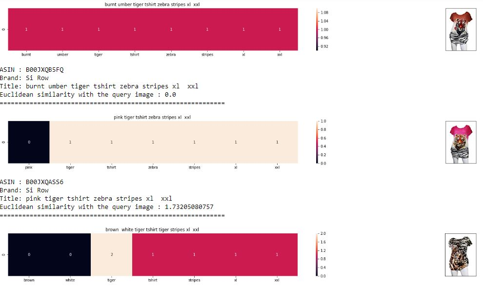

# Apparel-Recommendation
Recommends similar apparel products using content-based recommendation approach.

## Required Data-set Files 
1) tops_fashion.json
2) word2vec_model
- https://drive.google.com/open?id=1VAzVjLjJzWz2PYHjaoR60dhSXAtVHsoY
 

- ##### Pre-processed Amazon dataset of 183k products with 19 features to 28k products & used it to build a model.

- ##### Implemented Word2Vec & TF-IDF to find similar products and enhanced recommendation results by integrating module to find similar products by images using VGG16 CNN model.

## Data Set Overview
- Number of data points :  183138 (approx. 183k)
- Number of features/variables: 19
- Data attributes  
  a) ASIN - Amazon standard identification number  
  b) Author  
  c) Availability 
  d) Availability_type 
  e) Brand 
  f) Color 
  g) Editorial_reivew 
  h) Title 
  i) Formatted_price 
  j) Large_image_url 
  k) Manufacturer 
  l) Medium_image_url 
  m) Model 
  n) Product_type_name  
  o) Publisher 
  p) Reviews 
  r) Sku 
  s) Small_image_url 
  t) reviews 

### Approaches for Recommendation 
 

- Text Based Similarity 
  - Bag Of Word 
  - TF-IDF 
  - IDF
 
- word2vec
- Image features based product similarity

### Recommendation Result 
 

-  Products similar to currently viewed product "Burnt umber Tiger tshirt with zebra stripes" 
 

</img>
